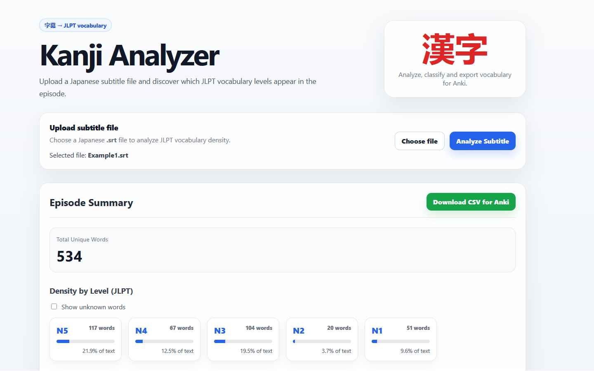

# Kanji Analyzer

<p align="center">
  
</p>

<p align="center">
  <strong>Analyze Japanese subtitle files and classify extracted vocabulary by JLPT level.</strong>
</p>

<p align="center">
  
  
  
</p>

## What is Kanji Analyzer?

Kanji Analyzer is a small full-stack project built with Go, React, and TypeScript.

It allows users to upload Japanese subtitle files (`.srt`), extract Japanese vocabulary from the text, classify each word by estimated JLPT level, and export the result as a CSV file for Anki.

The project includes both a web interface and a CLI, sharing the same Go analysis core.

## Features

- Upload `.srt` subtitle files through a React interface
- Extract Japanese vocabulary from subtitle text
- Classify vocabulary by JLPT level: N5, N4, N3, N2, N1, and Unknown
- Group extracted vocabulary by JLPT level
- Display readings for known vocabulary
- Hide or show unknown words
- Export vocabulary as CSV for Anki
- Reuse the same analysis core from both the HTTP API and CLI

## Tech Stack

### Backend

- Go
- `net/http`
- Kagome tokenizer
- Custom JLPT dictionary loader
- CLI support
- CSV export

### Frontend

- React
- TypeScript
- Vite
- CSS

## Project Structure

```txt
cmd/
  api/       HTTP API entrypoint
  cli/       CLI entrypoint
  dictgen/   JLPT dictionary generator

internal/
  analyzer/    Shared subtitle analysis use case
  dictionary/  JLPT dictionary loading
  exporter/    CSV export
  nlp/         Japanese tokenization and filtering
  stats/       JLPT density calculation
  subtitle/    SRT cleaning utilities

web/
  src/         React frontend
```

## Getting Started
Requirements
Go
Node.js
npm
Run the API

From the project root:

go run ./cmd/api

The API starts at:

http://localhost:8080
Run the frontend
cd web
npm install
npm run dev

Then open the local Vite URL shown in the terminal.

Run the CLI
go run ./cmd/cli -input samples/sample.srt -output anki_deck.csv
API Usage

You can analyze a subtitle file with curl:

curl -X POST -F "subtitle=@samples/sample.srt" http://localhost:8080/api/analyze

Example response:

{
  "stats": {
    "totalWords": 120,
    "levelCount": {
      "N5": 50,
      "N4": 30,
      "Unknown": 40
    },
    "density": {
      "N5": 41.6,
      "N4": 25,
      "Unknown": 33.3
    }
  },
  "vocabulary": [
    {
      "word": "食べる",
      "reading": "たべる",
      "level": "N5"
    }
  ]
}
CSV Export

The exported CSV contains:

word,reading,level
食べる,たべる,N5
学校,がっこう,N5
悪魔,あくま,N3

This file can be imported into Anki or used as a vocabulary review list.

Data Source

JLPT vocabulary data is based on Yomitan/Yomichan-compatible metadata derived from community JLPT vocabulary lists.

JLPT vocabulary lists are unofficial estimates and may not represent official JLPT exam content.

## Current Limitations

- JLPT classification depends on the dictionary source
- Unknown words may include names, slang, sound effects, anime-specific terms, or words outside JLPT lists
- Tokenization and dictionary matching may not always select the ideal canonical form
- The app currently analyzes vocabulary only, not grammar or sentence difficulty

## Roadmap

- Improve filtering for noise and sound effects
- Add meanings to vocabulary entries
- Improve Anki export templates
- Add drag-and-drop upload
- Add sample subtitle files
- Add Docker support
- Add deployment instructions
